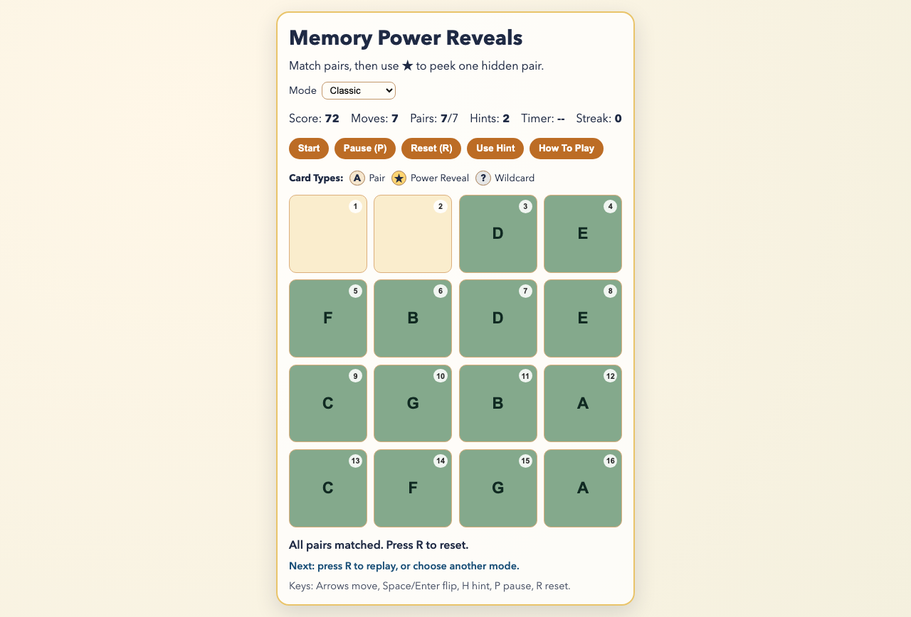

# daily-classic-game-2026-02-26-memory-power-reveals

<div align="center">
  <p><strong>Memory Power Reveals</strong> is a deterministic 4x4 concentration game with guided onboarding, three play modes, and transparent rules.</p>
</div>

<div align="center">
  
  <p>Classic memory gameplay + <code>★</code> reveal twist + deterministic automation hooks.</p>
</div>

## Quick Start

```bash
pnpm install
pnpm dev
```

## Detailed Step-By-Step Play

1. Open the game and choose a mode (`Classic`, `Zen`, or `Sprint`).
2. Press `Start` (or hit `Enter`) to begin.
3. Follow the tutorial overlay steps:
   - Start round
   - Flip first card
   - Match one pair
   - Trigger the `★` card once
   - Clear all pairs
4. On each turn, choose your first card (click or arrows + `Space/Enter`).
5. Choose a second card:
   - If symbols match, the pair locks in place.
   - If they do not match, both flip back after a short resolve delay.
6. Use `Use Hint` (or `H`) when needed:
   - `Classic`/`Sprint`: max 2 hints, each costs 5 score.
   - `Zen`: unlimited hints, no score cost.
7. Continue until you win or run out of time in Sprint.
8. Press `R` to reset the current mode, or switch mode from the selector.

## Modes

- **Classic**: standard scoring and penalties.
- **Zen**: no miss penalty, unlimited hints, no timer pressure.
- **Sprint**: 90-second round timer with streak bonus scoring.

## Rules

- Board is fixed at 4x4 cards.
- There are 7 matchable symbol pairs.
- One `★` power card reveals one hidden pair for a short time.
- One `?` wildcard card flips but never matches.
- Win by matching all 7 symbol pairs.
- Sprint ends when timer reaches `00:00`.

## Scoring

- Base match: `+10`
- Sprint streak bonus: `+4` extra per consecutive match after the first
- Miss penalty:
  - Classic/Sprint: `-2`
  - Zen: `0`
- Hint cost:
  - Classic/Sprint: `-5`
  - Zen: `0`
- Power card trigger bonus: `+2`

## Controls

- `Enter` or Start button: Start round / flip selected slot
- Arrow keys: Move board cursor
- `Space`: Flip selected slot
- `H`: Use hint
- `P`: Pause/resume
- `R`: Reset current mode

## Strategy Tips

- In Sprint, prioritize guaranteed matches over exploratory flips to preserve streak.
- Use the `★` reveal after you have partial memory, so the preview is actionable.
- In Classic, save hints for late-round uncertainty when hidden-card entropy is highest.
- In Zen, use hints to learn board patterns quickly without score pressure.

## FAQ

### Why do some cards not count as matches?
Only pair cards are matchable. `★` and `?` are special cards.

### Why can I not flip cards for a moment?
The game is in a resolve phase (mismatch, hint reveal, or power reveal timer).

### Why did Sprint end even though cards remain?
Sprint mode is timer-based; it ends when 90 seconds expire.

### Is this deterministic for automated testing?
Yes. Deck order and timing are deterministic via the exposed hooks.

## Verification

```bash
pnpm test
pnpm build
```

Deterministic browser hooks:

- `window.advanceTime(ms)`
- `window.render_game_to_text()`

Internal helper used by local solver automation (not public API):

- `window.__game.getState()`

## Project Layout

- `src/` game logic + UI
- `test/` deterministic behavior tests
- `playwright/main-actions/` scripted action payloads + solver outputs
- `assets/` hero and capture media
- `docs/plans/` implementation notes and audit

## GIF Captures

- Opening Sequence: `assets/gifs/opening-sequence.png`
- Midgame Sequence: `assets/gifs/power-reveal-sequence.png`
- Finale Sequence: `assets/gifs/finale-sequence.png`
